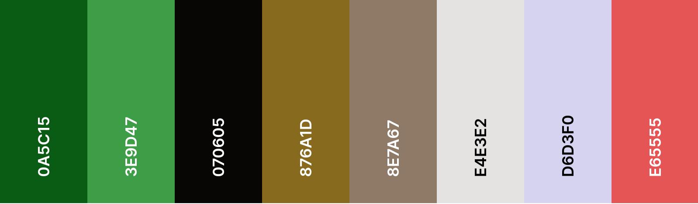

# Art of Tea

Tea... Is it  just a drink or is there something more behind it? From an early age tea was one of the main parts of daily life in different cultures and civilization.  
TEA connects people, calms the mind, brings harmony and balance.    
"Art of Tea" is a refuge for a soul in the bustle of the city, an island of calm in the very heart of Dublin!   
Tea ceremonies in our tea club proceed in the atmosphere of solitude and relaxation. This is an immersion into the secrets of the tea consuming traditions of the nations of the world, as well as a place for romantic dates and meetings with friends.

In "Art of Tea" you can visit one of our tea ceremonies, book an event for your company and buy nice fresh tea and teaware delivered straight to your doors!

Explore the misterious and amazing world of tea with us!

---

## Table of Contents
1. [**UX**](#ux)
    - [**Project Goals**](#project-goals)
    - [**User Stories**](#user-stories)
    - [**Design**](#design)
    - [**Wireframes**](#wireframes)

2. [**Features**](#features)
    - [**Existing Features**](#existing-features)
    - [**Features Left to Implement**](#features-left-to-implement)
3. [**Information Architecture**](#information-architecture)
    - [**Database Choice**](#database-choice)
    - [**Data Modelling**](#data-modelling)

4. [**Technologies Used**](#technologies-used)
    - [**Languages**](#languages)
    - [**Libraries and Frameworks**](#libraries-and-frameworks)
    - [**Tools**](#tools)
    - [**Databases**](#databases)

5. [**Testing**](#testing)
    - [**Manual Testing**](#manual-testing)
    - [**Validators**](#validators)
    - [**Compatibility**](#compatibility)

6. [**Deployment**](#deployment)
    - [**Local Deployment**](#local-deployment)
    - [**Remote Deployment**](#remote-deployment)

7. [**Credits**](#credits)
    - [**Content**](#content)
    - [**Media**](#media)
    - [**Code**](#code)
    - [**Acknowledgements**](#acknowledgements)
8. [**Disclaimer**](#disclaimer)

---

## UX

### Project Goals
#### Target Audience
- People who love tea
- People who want to get acquainted with tea culture
- People who want to organise a party in Chineese or Japaneese style, search for tea ceremony service
- People who want to get a new experiance, who curious about new things and want to get more knowldge about tea practise
- People who is interedted in Eastern culture in general
- People who want to buy tea and teaware, cary about good quality
- People who are into meditation, youga and similar practices   

#### Visitor/user goals:
- Purchase products/services shown on the website in a safe and secure way
- Read more about tea ceremonies and different aspects of drinking tea
- Organise the own custom tea event with special preferences

#### Business goals(site owner's goals):
- Provide users a secure professional e-commerce online shop
- Make profit from selling teas and tea ceremony services
- Promote tea culture in Ireland
- Make a brand more recognisable and expand the buisiness
### User Stories
:white_check_mark: *implemented*    

**As a user, I want/expect:**
- to access the website from any device (laptop, tablet, mobile)
- to easily navigate the website
- to read information about the business, its ideas and offers
- to learn more about different types of tea ceremonies, tea culture in general
- to view all the services and products information
- to view individual service/product details(e.g. image, price, quantity, description)
- being a new user, to create my own account
- being a returning user, to easily login/logout
- to reset my password if I forgot it 
- to have my personal profile with my personal information, needed for making payments
- to view my order history
- to be able to update my personal information, upload profile picture and delete it anytime
- to delete my account at any time
- to read reviews on the services/products
- to write my own review and to be able to edit/delete it
- to search and filter the products/services easily in order to buy a specific product I am looking for
- to sort all products/services by specific category
- to buy services/products: to be able to add them to my cart and to view my cart at any time
- to edit my cart and remove products/services from the cart 
- to view a total price of my purchases 
- to view delivery coast and to see how much more I need to spend to reach free delivery
- to make payments for the products/services by card in a safe and secure way
- to receive an email confirmation after checkout to make sure that payment was successfull
- to be able to read the company's private policy and delivery information
- to view events that happen in the tea club this week so that I can come and join any event
- to easily access social media links 
- to see the location of the company as well as its contact details
- to be able easily contact the owner/manager of the company if I have an additional query

**As a website owner, I want/expect:**
- to be able to add, edit and remove products/services
- to be able to be contacted by users through email if they have any special queries
### Design
#### Framework
- [Bootstrap](https://www.bootstrapcdn.com/), front-end framework is chosen for this project for its modern interface, ease of use and ability to be easily customized. It is used for creating features such as navbar, cards, forms, modals, as well as for its layout.
- [JQuery](https://jquery.com/) is used for initializing some Bootstrap, as well as for custom functions, DOM manipulation.
#### Colour Scheme
One of the main goals in UI was to focus user's attention on the products/services images. Therefore **calm** colors and **different shades** of one colour were mostly used accross the website's design.   
 Green, brown and black are the colours associated with tea help us to immerse users to the **tea world**. While different shades of grey colour allow us to create clean and neat backgrounds and volume effect accross the website.   
 

#### Typography
There are three fonts used across the project that I find a good combination: 
- [Open Sans](https://fonts.google.com/specimen/Open+Sans) used as the main body font, popular modern sans-serif typeface providing good readability.
- [Marko One](https://fonts.google.com/specimen/Marko+One) - elegant, decarative and eye-catching font, used mostly for headings.  
- [Sawarabi Mincho](https://fonts.google.com/specimen/Sawarabi+Mincho) - clean and simple font, perfectly fit to the "Art of Tea" and "East culture" theme.
#### Icons
Icons are used widely, as they are good attention grabbers. They help users to find and scan content quickly and easily. Another advantage of using them is to help to break language barriers. They create more user-friendly experience for people with non-native English by giving the visual clue about the subject.   
- I used [FontAwesome](https://fontawesome.com/) as the main icon library across the project (e.g. for social media links, forms, cart, search and user icons in navigation and others).
- Apart from that, I used some icons, specific to the tea world and East topic that were found in a free icons library [Flaticon](https://www.flaticon.com/). 
#### Further styling decisions
*will be added during development phase*
### Wireframes
[Balsamiq Wireframes](https://balsamiq.com/) tool was used to create all wireframes for the project.   

Initial wireframes for desktop, tablet and mobile can be found [here](https://github.com/irinatu17/Art-of-Tea/tree/master/wireframes).

---

## Features
### Existing Features
:white_check_mark: *implemented*     

#### Home page
#### Navbar
#### Contact
#### Footer
#### Register account
#### Login
#### Google and facebook login
#### Logout
#### About Page
#### Services
#### Single service details
#### Products
#### Single product details
#### Search
#### Cart
#### Checkout
#### Profile
#### Order history
#### Review
#### Admin product managment
#### Back to the top button
#### 404 and 500 error pages

### Features Left to Implement

---
## Information Architecture
### Database choice
During the development phase I worked with **sqlite3** database which is installed with Django.   
For deployment, a **PostgreSQL** database is provided by Heroku as an add-on.

### Data Modelling
#### User
The User model used in this project is provided by Django as a part of defaults "django.contrib.auth.models". More information about Django’s authentication system can be found [here](https://docs.djangoproject.com/en/3.0/ref/contrib/auth/).
#### Profile
| **Name** | **Database Key** | **Field Type** | **Validation** |
--- | --- | --- | --- 
 User | user | OneToOneField 'User' |  on_delete=models.CASCADE
 Avatar | avatart | ImageField | null=True, blank=True
 Username | username | CharField | max_length=254, null=False, blank=False
 Email | email | EmailField | max_length=254, null=False, blank=False
 Phone number | phone_number | CharField | max_length=20, null=False, blank=False
 Street address Line1 | street_address1 | CharField | max_length=80, null=False, blank=False
 Street address Line2 | street_address2 | CharField | max_length=80, null=True, blank=True
 Town/City | town_or_city | CharField | max_length=40, null=False, blank=False
 County | county | CharField | max_length=80, null=True, blank=True
 Country | country | CountryField | null=False, blank=False
 Postcode | postcode | CharField | max_length=20, null=True, blank=True

#### Service/Ceremony
| **Name** | **Database Key** | **Field Type** | **Validation** |
--- | --- | --- | --- 
 Sku | sku | CharField | max_length=254
 Name | name | CharField | max_length=254 
 Description | description | TextField | max_length=500 
 Price | price | DecimalField |max_digits=6, decimal_places=2 
 Rating | rating | DecimalField | max_digits=6, decimal_places=2, null=True, blank=True
 Image1 | image1 | ImageField | null=True, blank=True
 Image2 | image2 | ImageField | null=True, blank=True
 Image3 | image3 | ImageField | null=True, blank=True
 Image4 | image4 | ImageField | null=True, blank=True
 Image5 | image5 | ImageField | null=True, blank=True
 Date and Time | date_and_time | DateTimeField | 
 Duration | duration | 
 Number of participants  | number_of_participants | ...
 Place | place | 
#### Product
| **Name** | **Database Key** | **Field Type** | **Validation** |
--- | --- | --- | --- 
 Sku | sku | CharField | max_length=254
 Name | name | CharField | max_length=254 
 Description | description | TextField | max_length=500 
 Category | category | ForeignKey 'Category' | null=True, blank=True, on_delete=models.SET_NULL
 Price | price | DecimalField |max_digits=6, decimal_places=2 
 Rating | rating | DecimalField | max_digits=6, decimal_places=2, null=True, blank=True
 Weight | weight | IntegerField | null=True, blank=True
 Image1 | image1| ImageField | null=True, blank=True
 Image2 | image2| ImageField | null=True, blank=True
 Image3 | image3| ImageField | null=True, blank=True
 Availability | in_stock | Boolean | default=False
 
#### Tea Category
| **Name** | **Database Key** | **Field Type** | **Validation** |
--- | --- | --- | --- 
Programmatic Name | name | CharField | max_length=254
Friendly Name | friendly_name | CharField | max_length=254, null=True, blank=True
#### Order
| **Name** | **Database Key** | **Field Type** | **Validation** |
--- | --- | --- | --- 
Order Number | order_number | CharField | max_length=32, null=False, editable=False
User Profile | user_profile | ForeignKey 'UserProfile' | on_delete=models.SET_NULL, null=True, blank=True, related_name='orders'
Full Name | full_name | CharField | max_length=50, null=False, blank=False
Email | email | EmailField | max_length=254, null=False, blank=False
Phone number | phone_number | CharField | max_length=20, null=False, blank=False
Street address Line1 | street_address1 | CharField | max_length=80, null=False, blank=False
Street address Line2 | street_address2 | CharField | max_length=80, null=True, blank=True
Town/City | town_or_city | CharField | max_length=40, null=False, blank=False
County | county | CharField | max_length=80, null=True, blank=True
Country | country | CountryField | null=False, blank=False
Postcode | postcode | CharField | max_length=20, null=True, blank=True
Date | date | DateTimeField | auto_now_add=True
Delivery Cost | delivery_cost | DecimalField | max_digits=6, decimal_places=2, null=False, default=0
Order Total | order_total | DecimalField | max_digits=10, decimal_places=2, null=False, default=0
Grand Total | grand_total | DecimalField | max_digits=10, decimal_places=2, null=False, default=0
#### Review
| **Name** | **Database Key** | **Field Type** | **Validation** |
--- | --- | --- | --- 
 Author | author | OneToOneField 'User' |  on_delete=models.CASCADE
 Published Date | published_date | DateTimeField | blank=True, null=True, default=timezone.now
 Created Date | created_date | DateTimeField | auto_now_add=True
 Content | content | TextField |
 Rating | rating | DecimalField | max_digits=6, decimal_places=2
 Product |
 Service |
 
 
#### 

---

## Technologies Used

### Languages
- [HTML](https://developer.mozilla.org/en-US/docs/Web/HTML)
- [CSS](https://developer.mozilla.org/en-US/docs/Web/CSS) 
- [JavaScript](https://www.javascript.com/)
- [Python](https://www.python.org/) 
### Libraries and Frameworks
- [Django](https://www.djangoproject.com/) - Python framework for building the project.
- [Bootstrap](https://www.bootstrapcdn.com/) - as the front-end framework for layout and design.
- [Google Fonts](https://fonts.google.com/) - to import fonts.
- [FontAwesome](https://fontawesome.com/) - to provide icons used across the project. 
- [JQuery 3.5.0](https://jquery.com/) - to simplify DOM manipulation and to initialize Bootstrap functions.

### Tools
- [GitPod](https://www.gitpod.io/) - an online IDE for developing this project.
- [Git](https://git-scm.com/) - for version control.
- [GitHub](https://git-scm.com/) - for remotely storing project's code.
- [PIP](https://pip.pypa.io/en/stable/installing/) - for installation of necessary tools.
- [Jinja 2.10.1](https://jinja.palletsprojects.com/en/2.10.x/) - templating language for Python, to display back-end data in HTML.
- [Heroku](https://heroku.com/) - to host the project.
- [Stripe](https://stripe.com/ie) - to handle financial transactions.
- [AWS S3 Bucket](https://aws.amazon.com/) -  to store static files required on the site.
- [Gunicorn](https://pypi.org/project/gunicorn/) - a Python WSGI HTTP Server to enable deployment to Heroku.
- [Psycopg2](https://pypi.org/project/psycopg2/) - to enable the PostgreSQL database to function with Django.
- [Travis](https://travis-ci.org/) - for integration testing.
- [Coverage](https://coverage.readthedocs.io/en/coverage-5.1/) - 
- [Django Crispy Forms](https://django-crispy-forms.readthedocs.io/en/latest/) - to custom-style Django forms.
- [TinyPng](https://tinypng.com/) - for compressing images.
- [ImgBB](https://imgbb.com/) - to host images.
- [GIMP2](https://www.gimp.org/) - for editing and resizing images.
- [Balsamiq](https://balsamiq.com/) - to create wireframes.

### Databases
- [SQlite3](https://www.sqlite.org/index.html) - a development database.
- [PostgreSQL](https://www.postgresql.org/) - a production database.
---

## Testing
### Manual Testing

### Validators

### Compatibility

---

## Deployment
### Local Deployment

### Remote Deployment

---

## Credits

### Content
### Media
### Code

---
### Acknowledgements

## Disclaimer
