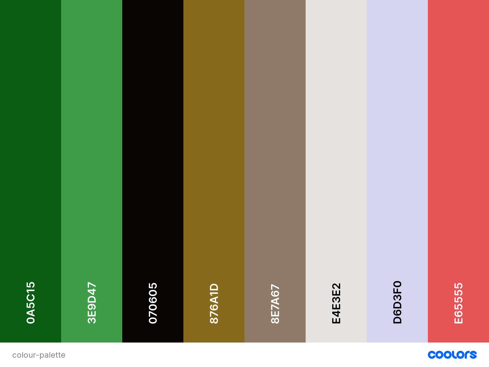

# [Art of Tea](https://art-of-tea.herokuapp.com/)

Tea... Is it just a drink or is there something more behind it? From an early age tea was one of the main parts of daily life in different cultures and civilization.  
Tea connects people, calms the mind, brings harmony and balance.    
**Art of Tea** is a refuge for a soul in the bustle of the city, an island of calm in the very heart of Dublin!   
Tea ceremonies in our tea club proceed in the atmosphere of solitude and relaxation. This is an immersion into the secrets of the tea consuming traditions of the nations of the world, as well as a place for romantic dates and meetings with friends.

In **Art of Tea** you can visit one of our tea ceremonies, book an event for your company and buy nice fresh tea and teaware delivered straight to your doors!

Explore the misterious and amazing world of tea with us!

---

## Table of Contents
1. [**UX**](#ux)
    - [**Project Goals**](#project-goals)
    - [**User Stories**](#user-stories)
    - [**Design**](#design)
    - [**Wireframes**](#wireframes)

2. [**Features**](#features)
    - [**Existing Features**](#existing-features)
    - [**Features Left to Implement**](#features-left-to-implement)
3. [**Information Architecture**](#information-architecture)
    - [**Database Choice**](#database-choice)
    - [**Data Modelling**](#data-modelling)

4. [**Technologies Used**](#technologies-used)
    - [**Languages**](#languages)
    - [**Libraries and Frameworks**](#libraries-and-frameworks)
    - [**Tools**](#tools)
    - [**Databases**](#databases)

5. [**Testing**](#testing)
    - [**Manual Testing**](#manual-testing)
    - [**Validators**](#validators)
    - [**Compatibility**](#compatibility)

6. [**Deployment**](#deployment)
    - [**Local Deployment**](#local-deployment)
    - [**Heroku Deployment**](#heroku-deployment)

7. [**Credits**](#credits)
    - [**Content**](#content)
    - [**Media**](#media)
    - [**Code**](#code)
    - [**Acknowledgements**](#acknowledgements)
8. [**Disclaimer**](#disclaimer)

---

## UX

### Project Goals
#### Target Audience
- People who love tea
- People who want to get acquainted with tea culture
- People who want to organise a party in Chineese or Japaneese style, search for tea ceremony service
- People who want to get a new experience, who curious about new things and want to get more knowledge about tea practise
- People interested in Eastern culture in general
- People who want to buy tea, teaware and care about good quality
- People who are into meditation, yoga and similar practices   

#### Visitor/user goals:
- Purchase products/services shown on the website in a safe and secure way
- Get information about tea ceremonies and different aspects of drinking tea
- Organise the custom tea event with special preferences

#### Business goals(site owner's goals):
- Provide users with a secure professional e-commerce online shop
- Make profit from selling teas, teaware and tea ceremony services
- Promote tea culture in Ireland
- Make a brand more recognisable and expand the business
### User Stories    
#### All users (guests, new users and authenticated users)
- As a user, I expect to access the website from any device, so that I can use the website anytime and anywhere.
- As a user, I expect to easily navigate the website, so that I can quickly find what I'm looking for.
- As a user, I want to easily access social media links of the company, so that I can read more information about it.
- As a user, I want to read a summary info about the business, its ideas and benifits, so that I can quickly decide if it satisfies my needs.
- As a user, I want to view events that happen in the tea club this week in Dublin, so that I can come and join any event.
- As a user, I want to see the location of the Tea Club on a map, so that I can find the address easily and come to the advertised events. 
- As a user, I want to be able easily contact the owner/manager of the company, so that I can write an additional query or ask a question.
- As a user, I want to learn more about different types of tea ceremonies, about tea culture in general, so that I can choose and book one of the tea ceremonies.
- As a user, I want to view service details and product details(e.g. image, price, description), so that I can book/buy some of them.
- As a user, I want to search and filter the products easily, so that I can quickly find a specific product I am looking for.
- As a user, I want to view and modify my order in the cart before completing it, so that I can make last changes easily before proceeding to payment. 
- As a user, I want to view a total price of my purchases and delivery coast, so that I will understand and see how much I will be charged.
- As a user, I expect to make payments by card in a safe and secure way, so that I won't be concerned about my card details safety and won't be charged incorrectly.
- As a user, I want to receive an email confirmation after checkout, so that I can make sure that payment was successfull.
#### New Users
- As a user, I want to create my own account, so that I can save, view and edit my profile details and view my order history.
#### Returning users
- As a user, I want to easily login anytime, so that I can get access to my  saved profile details and make next purchase quicker.
- As a user, I want to reset my password if I forgot it, so that I can get access to my profile again. 
#### Website Owner(admin)
- As a user, I want to have convenient and secure admin interface avalable only for website admin, so that I can add, edit and remove products/services.
- As a user, I want to recieve emails from the users when they fill out the contact form, so that I can reply on them satisfying users queries.
### Design
#### Framework
- [Bootstrap](https://www.bootstrapcdn.com/), front-end framework is chosen for this project for its modern interface, ease of use and ability to be easily customized. It is used for creating features such as navbar, cards, forms, modals, as well as for the layout.
- [JQuery](https://jquery.com/) is used for initializing some Bootstrap components, as well as for custom functions, DOM manipulation.
#### Colour Scheme
One of the main goals in UI was to focus user's attention on the products/services images. Therefore **calm** colors and **different shades** of one colour were mostly used accross the website's design.   
**Green** and **black** are the colours associated with tea world, help us to immerse users to the **tea world**. While bright **salmon** colour is used for some buttons, headings to create a contrast and catch user's attention.   
 Different shades of grey colour and shadows allow us to create clean and neat backgrounds and volume effect accross the website.   
 

#### Typography
There are three fonts used across the project that I find a good combination: 
- [Open Sans](https://fonts.google.com/specimen/Open+Sans) used as the main body font, popular modern sans-serif typeface providing good readability.
- [Marko One](https://fonts.google.com/specimen/Marko+One) - elegant, decorative and eye-catching font, used mostly for headings.  
- [Sawarabi Mincho](https://fonts.google.com/specimen/Sawarabi+Mincho) - clean and simple font, perfectly fit to the "Art of Tea" and "East culture" theme, used for navbar elements and some headings.
#### Icons
Icons are used widely, as they are good attention grabbers. They help users to find and scan content quickly and easily. Another advantage of using them is to help to break language barriers. They create more user-friendly experience for people with non-native English by giving the visual clue about the subject.   
- I used [FontAwesome](https://fontawesome.com/) as the main icon library across the project (e.g. for social media links, forms, cart, search and user icons in navigation and others).
- Apart from that, I used some icons, specific to the tea world and East topic, that were found in a free icon library [Flaticon](https://www.flaticon.com/). 

### Wireframes
[Balsamiq Wireframes](https://balsamiq.com/) tool was used to create all wireframes for the project.   

Initial wireframes for desktop, tablet and mobile can be found [here](https://github.com/irinatu17/Art-of-Tea/tree/master/wireframes).

**Note:** The website was changed and evolved through the development process and several improvements were applied.
The wireframes served as guidelines but some details such as positioning, placement of 
 images, buttons and other refinements diverge from the original wireframes.    
 Apart from that, there are some features that were included into original wireframes(such as reviews, social account login, image galleries for services/products), 
 but were considered of secondary importance and were not implemented yet due to time constraints. This is reflected in Features left to implement section, and I intend to come back to them and implement them in future when I can dedicate more time to it.

    <b><a href="#table-of-contents">↥ Back To Top</a></b>

---

## Features
Art of Tea website is composed by eight different applications: `landing`, `about`, `events`, `contact`, `products`(contains products and services), `cart`, `checkout`, `profiles`.
### Existing Features     
#### Navbar
The navbar is fixed at the top of the page all the time, this allows a user to easily navigate throughout the website.
 The **logo** is located in the top left corner on a desktop and in the center on the smaller devices. 
 It redirects the user to the home/landing page when clicked. On the smaller resolutions (tablet, mobile) 
 the navbar is collapsed into a burger icon. Menu links appear when the burger icon is clicked and collapse back, when clicked again.    
 
Navbar also contains a **search box**, where user can search for product and also cart icon. It's collapsed into a search icon on the mobile and tablet, and slides down when the icon is clicked.     
Also, navbar contains a **cart icon** alomg with a grand total displayed if there are items in the cart added. It changes the colour to yellow when there's something
in the cart to catch user's attention, and remains white(as other navbar elements) when the cart is empty. Clicking the cart icon will redirect user to the cart page.   

The difference in navbar for logged in, non-logged in users and admin:   
- For **non-logged in** users or guests navbar contains the following links: Login, Register.   
- For **logged in** users it contains the **"My Account"** nav-item which toggles down the following links that redirect user to the corresponding pages: My Profile, Order History, Logout.   
- For **admin** apart from all the links available for logged-in users mentioned above, there is also link to Admin Managment, where admin can add new products and services. That's avaliable only for superusers and defensive-design with corresponding error-messages is in place to protect this from manual entering the url in the browser.
#### Footer
Footer consists of 2 parts: main footer section and additional footer section which is displayed only on the large screens.   

Main footer section is stick to the bottom of the page and displayed across all the screens. It contains the social media icons-links which redirect a user to the corresponding page, opening in a new tab. As it is not the real company, the links redirect a user only to social media main pages.   
The additional desktop only section contains 
- **logo**, that is clickable and redirect to the landing page and also small paragraph about the company
- **quick links** to the main pages
- **contact information** that contains address, phone number and email

#### Landing(home) page
The landing page serves to attract new users to the business, to give a clear understanding about that and to attract users to use the website's functionality(book ceremony/buy products). It contains of 9 sections:
- **Hero image** section contains a full-screen image, main heading with a subheading and 2 buttons "Book tea ceremony" and "Buy tea or teaware" that redirect a user to the services and products pages correspondingly. The purpose of this section is to interest new user,to make the first impression and to call to action.
- **Introduction about** section  contains an introduction about the company, what it does and what can be find on the website. It also contain an image and "Learn more" button which redirects a user to the About page.
- **Quote**  section  contains heading and Osho's quote about process of drinking tea, that gives a user an impression and understanding of the some principles and ideas in the "Art of Tea" tea-club.
- **Our benefits** - this section provides a user information about the advantages of the company with a purpose of convincing users to use the functionality of the website. It contains 5 small benefits-paragraphs, along with authentic icons to enhance User Experience. 
- **Tea Ceremony** section contains a paragraph about tea ceremonies offered to book in the website, along with a button "View our services" that leads to the Services page. There's also an image-carousel with 3 images representing tea ceremonies.
- **Tea and Teaware** section also displays an image-carousel (3 images) and a paragraph about the online tea-shop products, along with a button "View our products" that redirects to the Products page. 
- **Events** section contains a paragraph about the events in happening in the tea club with a link to the Events page.
- **Reviews** sections contains the customer's reviews carousel with the user's avatars, review and usernames. Note: this section is static at the moment, but there's an intent to make it dynamic and to showcase real reviews, what's documented in Features left to implement section(reviews).
- **Contact** section contains a question and a link to the Contact page, allowing a user to post a query/question there via the form.

#### About page
The page provides the user an information about the main focus of the website, it's purposes, ideas and principals.    

It contains of 3 sections: **Who we are**, **Our principals** and **Our mission** followed by the images and an image-carousel in the last section.

#### Events page
This page represents the events happens each week in the tea club "Art of Tea". The short paragraph explains the user how the events are organised and about the donation system welcome.   

As well as that, the page contains **Weekly events table** displaying weekdays,time and name of the event that available in the tea club.   
There's also a **Find us here** section, showing the address, phone number and the link to the Facebook page, that would be checked to see more details about each week events.

#### Contact page
Contact page consist of 2 section:
- **Contact form** that's offered to fill out(name, email, message) if a user has any questions or queries. The real email will be sent to the admin of the website(handling by django "Sending email" functionality).
- **Contact details** section provides company's address, phone number and email, along with a Map showing the location of the tea club. Clicking at the red marker, a user can check the opening hours. Google Map API was used to accomplish that.

#### Products page
- The all products page displays Products cards including the following information: category, name, price. All product cards are clickable and redirect a user to the individual product page with detailed information (by clicking on the image or the "View details buttons").   
- If the user is **admin**, there are also 2 buttons displayed in the cards: **Edit** and **Delete**. Clicking Edit button redirects admin to the Edit Prodcut page. Delete button toggles the Delete modal. It asks a superuser to confirm if the product is to be deleted. If so, upon clicking "Delete" button, the product will be removed from the database, page reloads and the toast-message will inform about the sucessfull deletion. There is also a button "Cancel" that closes the modal when it's clicked. These actions can be done only by superuser, attepts to access to them by other users will end up with redirection to the landing page with toast error messages displayed.
- User can filter the products by **category** to see the specific items. When the category is clicked, the are the products displayed only of the selected category, as well as the  Category Name and number of the specific items satisfying the query.

#### Product details page
- The product details page displays information about the selected product: category, name, description, rating, price and product image (or placeholder if no image was added). Clicking the image will open it in the new tab, if the image_url is assigned.
- If a product is one of the tea categories, not teaware (that checked by using "has_weight" Boolean field), there's additional paragraph informing that price is displayed per 100g.
- The item quantity can be assigned filling the quantity form, the validation is in place restricting the quantity to the range of 1-999. The validation errors will be displayed, if the user tries to input the numbers outsade of that range.
- Product can be added to the cart by clicking **Add to cart** button, that will be reflected in the cart item in the navbar(grand total will be increased there). As well as that, the **toast success message** will be displayed when the product is added to the cart.
- If the user is **admin**, there are also 2 buttons displayed below the product name: **Edit** and **Delete**. Clicking Edit button redirects admin to the Edit Prodcut page. Delete button toggles the Delete modal. It asks a superuser to confirm if the product is to be deleted. If so, upon clicking "Delete" button, the product will be removed from the database, page reloads and the toast-message will inform about the sucessfull deletion. There is also a button "Cancel" that closes the modal when it's clicked. These actions can be done only by superuser, attepts to access to them by other users will end up with redirection to the landing page with toast error messages displayed.
- **Breadcrumbs** on the top of the page give a user an additional opportunity to navigate through the product-related pages(e.g. to come back to the category selected).
- **Go Back** button redirects user back to the All Products page.

#### Services
- Services page displays horizontal services cards including the following information: name, description, price and image. No-image placeholder is assigned if no image is provided. 
- Button "Learn more" redirects a user to the individual service page with detailed information. 
- Similar to products, **Edit** and **Delete** are displayed on the cards if the user is **admin** with the corresponding functionality to render Edit Service page and toggle Delete modal.
- At the bottom of the page there's a paragraph with a link to the **Contact page**, offering a user to contact a store manager for organising a custom tea ceremony anf discussing further details.
- As the website initial ideas and purposes do not presuppose to contain many services(there are only 4 services displayed), there is no filtering or searching options that are in place for the products pages. 

#### Service details page
- The service details page displays the following information: name, description, rating, price per person, itinerary, duration and image(or placeholder if no image was added). Clicking the image will open it in the new tab, if the image_url is assigned.
- **Itinerary** example table contains the time and description within the stated duration. This section's purpose is to showcase a user how the ceremony is organised, what is included in it. 
- For **admin** there is an **Itinerary form** functionality and **remove itinerary buttons** in the bottom of the page. That's allow a superuser to quickly add/delete itinerary items.
- Other features available only to the **admin** are the **Edit** and **Delete** (same as in the Services page) allowing admin to edit or delete services correspondingly.
- To **add service to cart** a user has to fill the form that contains 2 fields: number of participants and data-time. 
- **Number of participants** field is a quantity field in the back end, providing same functionality and validations as for quantity in product details page. The value range is withtin 1-100, the valudation error messages will be fired when user tries to enter invalid input. 
- The **datatime picker** allows a user to choose the desireble date and time. Only dates and times in future, after the current date/time can be assigned. As well as that, the hours are restricted to only open-hours(12-8 p.m.) and minute stepping is set to 30 to enhance User Experience.
- If the form is valid, clicking on **Add to Cart** button will update the cart with a new service added and success toast message will ensure a user that item was added to the cart.
- **Breadcrumbs** on the top of the page give a user an additional opportunity to navigate through the service-related pages(e.g. to come back to the all services page).
- **Go Back** button redirects user back to the Services page.

#### Cart page
- The link at the top of the page "Continue shopping" navigate back a user to the products page, if a user wants to add something else to the cart.
- Cart page is available for both logged in and non-logged in users, so that it is possible to make purchase being a guest.
- The page contains a summary of the user's order: the item's **name*, **image**, **quantitie**/ **number of participants**, **price**, **sub-total** and **sku**(for products).
- A user can **update** item's quantity/number of participants and data-time(if it's a service) and **remove** items from their order completely. To prevent from the accident clicking the remove button, the modal will be opened on click asking a user to confirm the deletion.
- **Toast messages** will be displayed when a user update/remove items in the cart.
- At the bottom of the page the **cart subtotal**, **delivery coast** and **grand total** are displayed.
- There is a **Checkout button** that takes a user to the checkout page to proceed the payment.

#### Checkout page
Checkout page contains 2 main section: checkout 3-steps form and order summary.
- **Order summary** includes short information about items in the order(image,name,quantity,subtotal,datetime), the link to **Edit cart**, redirecting a user to the Cart page, delivery cost and also **Total to pay**.
- **Checkout form** is represented as 3 tabs with the **Next** and **Go back** to navigate between the tabs. The form sections are the following **Personal Details**, **Billing/Shipping ingo** and **Payment**.
- If a user already has a profile with the shipping information saved, the form will be populated with this information.
- The **validation** messages will be displayed on click **Next** buttons, so a user can move on the next tab only if the current form-section is filled with valid information.
- The **save info** checkbox allows the form information to be saved to the user's profile for the **logged in** users.
- If it's a new or **non-logged** user there are links to register or login to save the information to the profile.
- Before proceeding the payment, user can review all the information in the table(**Form Summary**).
- There's also an optional **Comment** field for cases if a user has any additional comments to the order.
- A user is informed how much the card will be charged in the paragraph below the **Proceed to payment** button.
- Since the website is made for educational purposes only and the Stripe functionality is only for testing, only **4242 4242 4242 4242** card number will lead to the successfull payment.
- A webhook is used to make sure that the order is processed even in the cases when the payment process is interrupted(e.g. if a user accidently close the page or browser after clicking "Proceed to payment" button).
- Once the form is submitted and the payment is successfully proceeded, the **Checkout sucesss** page is loaded and a confirmation email is sent to the user's email. Also, a toast message is appeared to ensure the user that the order being processed successfully.

#### Checkout Success page
- The paragraph with a Thank you message is displayed on the top of the page to inform a user that the payment was proceed and the email was sent to the user's email.
- The 3 sections **Order info**, **Shipping details** and **Order Summary** contains all the information about the completed order. 
- **Keep shopping** button redirects user to the Products page.
- For logged-in users there's a button **View full order history** that takes users to the order history page.
- For non-logged in users the links to **create an account** page to allow to register and view an order history. 

#### Profile page
Profle feature is available only for **authenticated** users.
- Profile page contains **Personal info** section(username and email displayed). Also it contains 2 buttons **Change password** and **Manage emails**(changing the current or adding a new email) that takes a user to the corresponding pages (that's a part of Django allauth functionality with a customized templates).
- **Shipping details** section allows to save the shipping information, so for the next purchase the fields in the checkout form will be prefilled with this info. User can update this information anytime.
- **View order hostory** link will redirects a user to the Order History page.

#### Order History
Order history feature is available only for **authenticated** users.
- If a user has not made any purchase, the paragraph will inform that the order history is empty with a link to the Product page.
- If there are completed orders, the table with the following fields: **Order Number**, **Date**, **Items**, **Total** is in place.
- Clicking the link on the Order number will redirects a user to the **checkout success** page with all the order information. The Toast info message will tell the user that it's a past confirmation for the order number.
- **View My Profile** link will redirects a user to the Profile page.

#### Admin product managment
Admin managment feature is available only for **authenticated superuser**.
Admin page allows an owner of the website to add new products/services by filling out one of the two forms - **Add New Product** and **Add New Service**. 
If the form is valid, the product/service is added to the database and the user is redirected to the new created product/service details page.
The defensive design is implemented to restrict others than admin users to manually enter the url to get access to the page. User will be redirected to the home page with the toast error messages appeared.

#### Django-allauth features
##### Sign Up
The sign up page allows a user to create a new account. The user is asked to fill the fields "email", "username", "password" and "password(again)". When adding a username, the code compares it against existing email to ensure that it is unique. If user's input does not meet requirements, flash messages will inform a user about the error. When the form is submitted, a **verification email** is sent to the user's email to verify the email and finish registration process.   
There is also a link to the login page for existing users at the bottom of the form.
##### Login
The login page features the form with "username" and "password" fields, allowing registered users to log into their account. If the login was successfull, a user is redirected to the home page and the toast success message appears informing that the log in was successful. Otherwise, flash messages will be displayed about incorrect user's input.   
There is also a link to the sign up page for new users at the bottom of the form.
As well as that, there's a link to the **forgot password** functionality, using which a user can reset their password.
##### Forgot password
A user can reset their password to be able to login by entering the email. Then the link for reseting password will be sent to the email provided. The user can create a new password and then login with a new password.
##### Logout
Hitting "logout" button renders logout page, asking to confirm if a user wants to logout. It will end their session and redirects to the homepage with a toast success message appeared .

### Features Left to Implement
There are some features that I considered were of secondary importance and I have not implemented them yet due to time constraints, but intend to do so in future when I will be able to dedicate more time to them. Most of these features are displayed in my [original wireframes](https://github.com/irinatu17/Art-of-Tea/tree/master/wireframes).
#### Star based  Rating and Reviews
Users would be able to create, edit and delete their reviews for products and services. Rating would be displayd as stars(0-5) in the pruduct details and service details pages. Also, in the landing page reviews section, the static reviews would be replaced with the real ones, displaying up to 5 random reviews from the database.
#### User avatart
This feature would allow users to assigne the standard randomly picked avatar or upload their own photos/avatart. Avatar would be displayed on the user Profile page and also near the reviews, if a user have some.
####  Social account login (Google and Facebook)
This feature allows users to login using social networks accounts, Google and Facebook, that would enhance user experience and make the login process easier.
#### Image galleries 
As can be viewed in the original wireframes, I initially planned to assigne up to 3 for products and 5 for services images. An attempt at this was made by creating **ImageGallery** Model in the Products app. However, this feature would require much more time to search for the sutable images, resize them and implement further functionality. So due to mentioned above time constraints the ImageGallery model was removed from the database,image and image_url fields were moved to the Product model. In the future, I would like to implement this feature and add more images to the products and services for enchancing User Experience.
#### 404 and 500 error pages
I would also like to implement custom 404 and 500 pages containing a paragraph about the error and a button "Back Home". This would improve and simplify the navigation back to the website in case the user is get lost and error occured.   

Other small features are also consider to be implemented in feature, such as **Back to Top button**, **Scroll down button** on the landing page, **Sorting products** by price/name.

    <b><a href="#table-of-contents">↥ Back To Top</a></b>

---
## Information Architecture
### Database choice
During the development phase I worked with **sqlite3** database which is installed with Django.   
For deployment(production), a **PostgreSQL** database is provided by Heroku as an add-on.
- The **User model** used in this project is provided by Django as a part of defaults `django.contrib.auth.models`. More information about Django’s authentication system can be found [here](https://docs.djangoproject.com/en/3.0/ref/contrib/auth/).

### Data Modelling
#### Profile App
##### Profile
| **Name** | **Database Key** | **Field Type** | **Validation** |
--- | --- | --- | --- 
 User | user | OneToOneField 'User' |  on_delete=models.CASCADE
 Full Name | profile_full_name | CharField | max_length=70, null=True, blank=True
 Phone number | profile_phone_number | CharField | max_length=20, null=True, blank=True
 Address Line1 | profile_address_line1 | CharField | max_length=60, null=True, blank=True
 Address Line2 | profile_address_line2 | CharField | max_length=60, null=True, blank=True
 Town/City | profile_town_or_city | CharField | max_length=50, null=True, blank=True
 County | profile_county | CharField | max_length=50, null=True, blank=True
 Postcode | profile_postcode | CharField | max_length=20, null=True, blank=True
 Country | profile_country | CountryField | blank_label='Country', null=True, blank=True

#### Products App
##### Product
| **Name** | **Database Key** | **Field Type** | **Validation** |
--- | --- | --- | --- 
 Category | category | ForeignKey 'Category' | null=True, blank=True, on_delete=models.SET_NULL
 Name | name | CharField | max_length=254 
 Description | description | TextField | max_length=800 
 Price | price | DecimalField |max_digits=6, decimal_places=2, validators=[MinValueValidator(0.01)] 
 Rating | rating | DecimalField | max_digits=2, decimal_places=1, null=True, blank=True, validators=[MinValueValidator(0), MaxValueValidator(5)]
 Is a service | is_a_service | BooleanField | default=False
 Image | image| ImageField | null=True, blank=True
 Image Url | image_url | URLField | max_length=1024, null=True, blank=True
 Has Weight | has_weight | BooleanField | default=False, null=True, blank=True
 Sku | sku | CharField | max_length=254, null=True, blank=True
 Duration | duration | IntegerField | null=True, validators=[MinValueValidator(1), MaxValueValidator(24)]
 
##### Category
| **Name** | **Database Key** | **Field Type** | **Validation** |
--- | --- | --- | --- 
Programmatic Name | name | CharField | max_length=254
Friendly Name | friendly_name | CharField | max_length=254, null=True, blank=True

##### Itinerary
| **Name** | **Database Key** | **Field Type** | **Validation** |
--- | --- | --- | --- 
Name | name | CharField | max_length=254, null=True
Service | service | OneToOneField 'Product' | null=True, blank=True, on_delete=models.CASCADE

##### Itinerary Item
| **Name** | **Database Key** | **Field Type** | **Validation** |
--- | --- | --- | --- 
Itinerary | itinerary | ForeignKey 'Itinerary' | null=True, blank=True, on_delete=models.CASCADE
Time | time | CharField | max_length=254
Text | text | CharField | max_length=254

#### Checkout App
##### Order
| **Name** | **Database Key** | **Field Type** | **Validation** |
--- | --- | --- | --- 
Order Number | order_number | CharField | max_length=32, null=False, editable=False
Profile | profile | ForeignKey 'Profile' | on_delete=models.SET_NULL, null=True, blank=True, related_name='orders'
Full Name | full_name | CharField | max_length=70, null=False, blank=False
Email | email | EmailField | max_length=254, null=False, blank=False
Phone number | phone_number | CharField | max_length=20, null=False, blank=False
Address Line1 | address_line1 | CharField | max_length=60, null=False, blank=False
Address Line2 | address_line2 | CharField | max_length=60, null=False, blank=False
Town/City | town_or_city | CharField | max_length=50, null=False, blank=False
County | county | CharField | max_length=50, null=True, blank=True
Postcode | postcode | CharField | max_length=20, null=True, blank=True
Country | country | CountryField | blank_label='Country*', null=False, blank=False
Purchase Date | purchase_date | DateTimeField | auto_now_add=True
Delivery Cost | delivery_cost | DecimalField | max_digits=6, decimal_places=2, null=False, default=0
Order Total | order_total | DecimalField | max_digits=10, decimal_places=2, null=False, default=0
Grand Total | grand_total | DecimalField | max_digits=10, decimal_places=2, null=False, default=0
Original Cart | original_cart | TextField | null=False, blank=False, default=''
Stripe Pid | stripe_pid | CharField | max_length=254, null=False, blank=False, default=''
Comment | comment | TextField | max_length=254, null=True, blank=True

##### Order Item Details 
| **Name** | **Database Key** | **Field Type** | **Validation** |
--- | --- | --- | --- 
Order | order | ForeignKey 'Order' | null=False, blank=False, on_delete=models.CASCADE, related_name='orderitems'
Product | product | ForeignKey 'Product' | null=False, blank=False, on_delete=models.CASCADE
Quantity | quantity | IntegerField | null=False, blank=False, default=0
Item Total | item_total | DecimalField | max_digits=6, decimal_places=2, null=False, blank=False, editable=False
Datetime | datetime | CharField | null=True, blank=True, max_length=20

    <b><a href="#table-of-contents">↥ Back To Top</a></b>

---

## Technologies Used

### Languages
- [HTML](https://developer.mozilla.org/en-US/docs/Web/HTML)
- [CSS](https://developer.mozilla.org/en-US/docs/Web/CSS) 
- [JavaScript](https://www.javascript.com/)
- [Python](https://www.python.org/) 
- [Jinja](https://jinja.palletsprojects.com/en/2.10.x/) - templating language for Python, to display back-end data in HTML.

### Libraries and Frameworks
- [Django](https://www.djangoproject.com/) - Python framework for building the project.
- [Bootstrap](https://www.bootstrapcdn.com/) - as the front-end framework for layout and design.
- [Google Fonts](https://fonts.google.com/) - to import fonts.
- [FontAwesome](https://fontawesome.com/) - to provide icons used across the project. 
- [JQuery](https://jquery.com/) - to simplify DOM manipulation and to initialize Bootstrap functions.
- [Gunicorn](https://pypi.org/project/gunicorn/) - a Python WSGI HTTP Server to enable deployment to Heroku.
- [Psycopg2](https://pypi.org/project/psycopg2/) - to enable the PostgreSQL database to function with Django.
- [Stripe](https://stripe.com/ie) - to handle financial transactions.
- [Django Crispy Forms](https://django-crispy-forms.readthedocs.io/en/latest/) - to style Django forms.
- [Coverage](https://coverage.readthedocs.io/en/coverage-5.1/) - to see the percentage of the automated testsing.

### Tools
- [GitPod](https://www.gitpod.io/) - an online IDE for developing this project.
- [Git](https://git-scm.com/) - for version control.
- [GitHub](https://git-scm.com/) - for remotely storing project's code.
- [PIP](https://pip.pypa.io/en/stable/installing/) - for installation of necessary tools.
- [Heroku](https://heroku.com/) - to host the project.
- [AWS S3 Bucket](https://aws.amazon.com/) -  to store user-uploaded media files.
- [WhiteNoise](http://whitenoise.evans.io/en/stable/) - to store static files.
- [Boto3](https://boto3.amazonaws.com/v1/documentation/api/latest/index.html) for compatibility with AWS.
- [Travis](https://travis-ci.org/) - for integration testing.
- [TinyPng](https://tinypng.com/) - for compressing images.
- [ImgBB](https://imgbb.com/) - to host images.
- [GIMP2](https://www.gimp.org/) - for editing and resizing images.
- [Balsamiq](https://balsamiq.com/) - to create wireframes.

### Databases
- [SQlite3](https://www.sqlite.org/index.html) - a development database.
- [PostgreSQL](https://www.postgresql.org/) - a production database.

    <b><a href="#table-of-contents">↥ Back To Top</a></b>

---

## Testing
### Manual Testing

### Validators

### Compatibility

    <b><a href="#table-of-contents">↥ Back To Top</a></b>

---

## Deployment
The Art of Tea project was developed using the [GitPod](https://www.gitpod.io/) online IDE and
using Git & GitHub for version control. It is hosted on the [Heroku](https://heroku.com/) platform, with static files on WhiteNoise and user-uploaded images being hosted in AWS S3 Basket.
### Local Deployment
To be able to run this project, the following tools have to be installed:
- An IDE of your choice (I used [GitPod](https://www.gitpod.io/) for creating this project)
- [Git](https://git-scm.com/)
- [PIP](https://pip.pypa.io/en/stable/installing/) 
- [Python3](https://www.python.org/download/releases/3.0/)    

Apart from that, you also need to create accounts with the following services:
- [Stripe](https://stripe.com/en-ie)
- [AWS](https://aws.amazon.com/) to setup the [S3 basket](https://docs.aws.amazon.com/AmazonS3/latest/gsg/CreatingABucket.html)
- [Gmail](https://mail.google.com/)

#### Directions
1. You can clone this repository directly into the editor of your choice by pasting the following command into the terminal:   
`git clone https://github.com/irinatu17/Art-of-Tea`    
Alternatively, you can save a copy of this repository by clicking the green button **Clone or download** , then **Download Zip** button, and after extract the Zip file to your folder.      
In the terminal window of your local IDE change the directory (CD) to the correct file location (directory that you have just created).       

Note: You can read more information about the cloning process on the [GitHub Help page](https://docs.github.com/en/github/creating-cloning-and-archiving-repositories/cloning-a-repository).   

2. Set up environment variables.     
Note, that this process will be different depending on IDE you use.   
In this it was done using the following way:      
    - Create `.env` file in the root directory.
    - Add `.env` to the `.gitignore` file in your project's root directory
    - In `.env` file set environment variables with the following syntax:     
    `import os`   
    `os.environ["DEVELOPMENT"] = "True"`    
    `os.environ["SECRET_KEY"] = "<Your Secret key>"`    
    `os.environ["STRIPE_PUBLIC_KEY"] = "<Your Stripe Public key>"`    
    `os.environ["STRIPE_SECRET_KEY"] = "<Your Stripe Secret key>"`    
    `os.environ["STRIPE_WH_SECRET"] = "<Your Stripe WH_Secret key>"`       
       
Read more about how to set up the Stripe keys in the [Stripe Documentation](https://stripe.com/docs/keys)
    
3. Install all requirements from the **requirements.txt** file putting this command into your terminal:     
`pip3 install -r requirements.txt`     
4. In the terminal in your IDE migrate the models to crete a database using the following commands:         
`python3 manage.py migrate`     
5. Load the data fixtures(**categories**, **products**, **itinerary**, **itinerary_items**) in that order into the database using the following command:    
`python3 manage.py loaddata <fixture_name>`        
6. Create a super user to have an access to the the admin panel(you need to follow the instructions then and insert username,email and password):    
`python3 manage.py createsuperuser`   
7. You will now be able to run the application using the following command:     
`python3 manage.py runserver`     
8. To access the admin panel, you can add the `/admin` path at the end of the url link and login using your superuser credentials.

### Heroku Deployment
*To start Heroku Deployment process, you need to clone the project as described in the [Local deployment](#local-deployment) section above.*     
To deploy the project to [Heroku](https://heroku.com/) the following steps need to be completed:    
1. Create a **requirement.txt** file, which contains a list of the dependencies, using the following command in the terminal:    
`pip3 freeze > requirements.txt`    
2. Create a **Procfile**, in order to tell Heroku how to run the project, using the following command in the terminal:
`web: gunicorn art_of_tea.wsgi:application`    
3. `git add`, `git commit` and `git push` these files to GitHub repository.     
NOTE: these 1-3 steps already done in this project and included in the GitHub repository, but illistrated here as they are required for the successfull deployment to Heroku.   
4. On the [Heroku](https://heroku.com/) website you need to create a **new app**, assigne a name (must be unique),set a region to the closest to you(for my project I set Europe) and click **Create app**.   
5. Go to **Resources** tab in Heroku, then in the **Add-ons** search bar look for **Heorku Postgres**(you can type `postgres`), select **Hobby Dev — Free** and click **Provision** button to add it to your project.     
6. In Heroku **Settings** click on **Reveal Config Vars**.   
7. Set the following config variables there:     

| KEY            | VALUE         |
|----------------|---------------|
| AWS_ACCESS_KEY_ID | `<your aws access key>`  |
| AWS_SECRET_ACCESS_KEY | `<your aws secret access key>`  |
| DATABASE_URL| `<your postgres database url>`  |
| EMAIL_HOST_PASS | `<your email password(generated by Gmail)>` |
| EMAIL_HOST_USER| `<your email address>`  |
| SECRET_KEY | `<your secret key>`  |
| STRIPE_PUBLIC_KEY| `<your stripe public key>`  |
| STRIPE_SECRET_KEY| `<your stripe secret key>`  |
| STRIPE_WH_SECRET| `<your stripe wh key>`  |
| USE_AWS | `True`  |

    <b><a href="#table-of-contents">↥ Back To Top</a></b>

---

## Credits

### Content
### Media
### Code

    <b><a href="#table-of-contents">↥ Back To Top</a></b>

---
### Acknowledgements

## Disclaimer
This site is intended for **educational purposes** only.

    <b><a href="#table-of-contents">↥ Back To Top</a></b>

